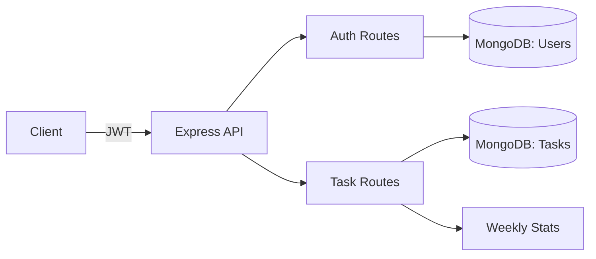

# To-Do List Backend API

Production-ready backend for a to-do list app. Includes JWT authentication, input validation, rate limiting, collaboration, analytics, and flexible task filtering.

**Features**
- JWT auth with register/login/change-password/logout
- Task CRUD with priorities, tags, due dates, and reminders
- Collaboration: share tasks with read/write permissions
- Advanced filtering and search via query parameters
- Weekly analytics for completed tasks
- Global error handling and request validation
- MongoDB integration with Mongoose

**Tech Stack**
- Node.js, Express, MongoDB, Mongoose
- JWT for authentication
- express-validator for validation
- express-rate-limit for basic abuse protection

**Getting Started**
1. Install dependencies:
```bash
npm install
```
2. Create `.env`:
```bash
MONGO_URL=your_mongodb_connection_string
PORT=5000
JWT_SECRET=your_secret
JWT_EXPIRES_IN=1d
NODE_ENV=development
```
3. Run the server:
```bash
npm start
```
For hot reload:
```bash
npm run dev
```

**Scripts**
- `npm start` Start the server
- `npm run dev` Start with nodemon
- `npm run seed` Seed demo user and tasks

**Dependencies**
- `express`, `mongoose`, `jsonwebtoken`, `bcryptjs`, `dotenv`, `cors`, `morgan`
- `express-validator`, `express-rate-limit`

**API Examples (Postman or curl)**

Register:
```bash
curl -X POST http://localhost:5000/api/auth/register \
  -H "Content-Type: application/json" \
  -d '{"username":"demo","email":"demo@example.com","password":"password123"}'
```

Login:
```bash
curl -X POST http://localhost:5000/api/auth/login \
  -H "Content-Type: application/json" \
  -d '{"email":"demo@example.com","password":"password123"}'
```

Create task:
```bash
curl -X POST http://localhost:5000/api/tasks \
  -H "Authorization: Bearer YOUR_TOKEN" \
  -H "Content-Type: application/json" \
  -d '{"title":"Buy milk","priority":"high","tags":["home"],"dueDate":"2026-02-20"}'
```

List tasks with filters:
```bash
curl "http://localhost:5000/api/tasks?completed=false&priority=high&tag=home&q=milk" \
  -H "Authorization: Bearer YOUR_TOKEN"
```

Update task:
```bash
curl -X PUT http://localhost:5000/api/tasks/TASK_ID \
  -H "Authorization: Bearer YOUR_TOKEN" \
  -H "Content-Type: application/json" \
  -d '{"completed":true}'
```

Delete task:
```bash
curl -X DELETE http://localhost:5000/api/tasks/TASK_ID \
  -H "Authorization: Bearer YOUR_TOKEN"
```

Share task:
```bash
curl -X POST http://localhost:5000/api/tasks/TASK_ID/share \
  -H "Authorization: Bearer YOUR_TOKEN" \
  -H "Content-Type: application/json" \
  -d '{"userId":"USER_ID","permission":"read"}'
```

Weekly analytics:
```bash
curl http://localhost:5000/api/tasks/stats/weekly \
  -H "Authorization: Bearer YOUR_TOKEN"
```

**Filtering & Search**
- `q` Search in title/description
- `completed` `true|false`
- `priority` `low|medium|high`
- `tag` A single tag
- `createdFrom`, `createdTo` ISO dates
- `dueFrom`, `dueTo` ISO dates
- `includeShared` `true` to include tasks shared with the user

**Seeding**
The seed script creates a demo user and a couple of tasks.
Optional envs:
- `SEED_RESET=true` to wipe existing data
- `SEED_USER_EMAIL`, `SEED_USER_PASSWORD` to customize demo credentials

Run:
```bash
npm run seed
```

**Diagram**

